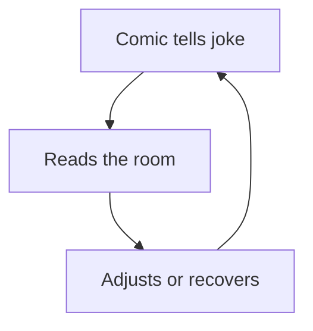

# Episode 3: Beauty Standards, Twitter and AI Girlfriends (Mark Normand)

Guest: Mark Normand, stand-up comedian. An honest note on fidelity: this is a comedy episode first. The AI material is a strong subtheme, not the whole show. The chapters before and after this one treat AI as the main course. Here it arrives inside jokes, which is exactly why the two serious ideas land harder.

The episode's AI question: what happens when machines can fake the two things men pay for, attention and intimacy?

## The episode in one paragraph

Williamson and Normand discuss AI companions built on real creators. They cover the evolutionary psychology of why men pay for parasocial attention, a comedian's test of AI-written jokes, and the ethics of synthetic outlets for dark desires. The throughline from guest and host: AI can fake the content of intimacy but not the status of being chosen, and that gap is load-bearing.

### AI Amaranth: the product

Amaranth is an OnlyFans creator and one of the most followed women on Twitch. She released an AI companion of herself. Fans chat with it, ask questions, and get voice responses. The product sells what the episode keeps circling: not images, which are free everywhere, but attention that feels personal.

Williamson names the economic logic. OnlyFans looked puzzling at first because free pornography of every variety already existed, unlimited. So what were men paying for? His answer: the parasocial relationship. The feeling that the star notices you, says your name, gives you thirty seconds that feel personal. AI companions industrialize exactly that feeling.

### Why men pay for one woman when variety is free

The episode offers an evolutionary-psychology account, via Williamson's conversation with William Costello, an evolutionary psychology researcher. The puzzle: men report stronger desire for sexual variety than women. In erotica, men cycle through a new woman each chapter while women follow one male protagonist through the whole book. So why do men pay for access to one specific creator when infinite variety costs nothing?

The answer is that the purchase is not about variety. It is about **selection and prestige**. Being noticed by a specific desirable person carries status because she chose to notice you. Anyone with the price of a cheeseburger a month can subscribe, as Normand puts it, so the subscription itself carries no prestige. But the fantasy being sold is selection: she picked you out of the crowd. AI girlfriends break this completely. There is no selection when the product selects everyone. That missing prestige is, in Costello's telling, a kind of protection. The synthetic version cannot replace the real one because the value was never in the pixels. It was in being chosen.


*Figure 1. Selection, not content, is the scarce good AI cannot fake. AI Podcast Curriculum, Ep 03, Mark Normand, 2023-06-01. Source: original diagram from episode claims via Costello.*

Normand adds the host's warning as a joke with teeth: if men ever start bragging "my AI girlfriend is hotter than yours," that is the sign the protection failed. As long as owning one is unimpressive, the market stays bounded.

### The comedian versus the machine

Normand describes a comic who read two jokes on stage: one he wrote, one AI wrote in his voice, and asked the crowd to tell them apart. The crowd could tell. The human joke was better by a distance, and Normand says the result relieved him.

His theory of why: comedy is context. A computer can build a setup, a twist, and a punchline. It cannot feel the room. When a joke bombs, the comedian says so, and the admission gets a laugh. That recovery is a live read of hundreds of faces at once. Normand doubts AI can do it.

He offers a test for machine consciousness disguised as a joke: we will know AI is conscious when it walks off stage regretting the funnier thing it should have said. The laugh in the room covers a serious point. Regret requires a self that persists after the interaction and judges its own performance. Current systems do not have that.

```
regret = memory(performance) + standard(applied after the fact)
```

*Figure 2. The regret test as a definition: no persistent self, no regret, no consciousness by this test. AI Podcast Curriculum, Ep 03, Mark Normand, 2023-06-01. Source: original definition from episode claims.*

He also mentions **Darkbot**, an experiment that trained a chatbot on dark-web forums instead of the surface web, to see if it could write the twisted jokes normal models refuse. [uncertain] The episode gives no source for Darkbot beyond the mention. Treat it as a bar anecdote, not a verified project.



*Figure 3. The live control loop AI cannot run: no room, no stakes, no self. AI Podcast Curriculum, Ep 03, Mark Normand, 2023-06-01. Source: original diagram from episode claims.*

### The methadone question

The darkest segment asks whether synthetic outlets reduce real-world harm. The analogy used is methadone: a controlled substitute that keeps an addict off the street drug. If illustrations or robots give dangerous desires an outlet at home, does real-world damage fall?

Williamson and Normand do not resolve it. They note the tension honestly. If sex work is harm, you should cheer for the synthetic substitute. But the resistance to that conclusion is strong, including from women, which Williamson reads through the lens of intersexual competition discussed in Episode 8. The episode leaves the question open and marks it as open. That is the honest move and this chapter keeps it.

| Argument | Mechanism | Open question |
|---|---|---|
| Substitution reduces harm | Outlet at home, less real-world damage | Does use fall or spread? |
| Substitution normalizes desire | Practice trains the want | Does the want grow? |

*Figure 4. The methadone question as an open matrix: both columns hold, neither closes. AI Podcast Curriculum, Ep 03, Mark Normand, 2023-06-01. Source: original table from episode claims.*

### The AI Mark bot

Normand tried a personal AI trained on his own podcast appearances. Feed every episode into a language model and you get a moderately accurate Mark that answers questions in his voice. His reaction is comic horror: nobody wants two of him, and the AI version would still be late. The segment makes the general point concrete. Cloning a voice and a manner is now a weekend project. The barrier is not technology. It is whether anyone wants the clone.

## Q and A

**1. Explain the parasocial business model like I am new to it.**
A fan pays a creator not for content but for the feeling of being noticed. The creator says the fan's name, answers a message, gives thirty seconds of personal attention. Free pornography cannot sell this because it is made for everyone. OnlyFans sells the opposite: content made, apparently, for you. AI companions try to automate that exact feeling at scale.

**2. Why does the episode say AI girlfriends cannot fully replace real relationships?**
Because the value men pay for is selection, not images. Being chosen by a desirable person carries status precisely because not everyone gets chosen. An AI girlfriend chooses everyone, so it confers no status. The product can fake attention but not prestige, and prestige was the scarce good all along.

**3. What is the comedian's theory of why AI cannot do stand-up?**
Stand-up is a live control loop. The comic reads the room, adjusts timing, and converts failures into laughs by naming them. A language model produces text without a room, without stakes, and without a self that feels the bomb. The setup-punchline machinery is the easy part. The context is the skill.

**4. Applied question: a creator asks you whether to launch an AI companion of themselves. What do you advise, using this episode?**
You tell them the product sells attention, not likeness, so the design problem reads: make attention feel scarce and personal. You warn them about the prestige problem: if the companion is available to everyone identically, it cannot carry the selection premium that made the creator valuable. And you flag the Normand test: the moment fans brag about whose AI companion is hotter, the mystique that priced the real creator is gone.

**5. What is the methadone analogy, and why does the episode leave it unresolved?**
Methadone gives addicts a controlled substitute to reduce street-drug harm. The analogy asks whether synthetic sexual outlets reduce real-world harm the same way. It stays unresolved because the empirical question, does substitution reduce harm or normalize the desire, has no clean answer in the episode, and because the moral intuitions on both sides are strong. An honest chapter does not manufacture a verdict the source did not reach.

**6. What does the regret test say about machine consciousness?**
That consciousness might show up as post-performance regret: the system replaying an interaction and wishing it had said the funnier thing. The test is useful because it demands a persistent self with standards, not just good outputs. A model can produce a great joke and still fail the test. Passing requires the machine to care after the fact.

## Memory aids

**Mnemonic: P-S-P.** The three things men pay for: **P**arasocial attention, **S**election, **P**restige. AI fakes the first and cannot supply the other two. "Pay for PSP."

**Never-confuse pair: content vs attention.** Content is the image or the message. Attention is the feeling of being singled out. Free porn won the content war decades ago. The entire paid market is an attention market. Every AI companion pitch that talks about image quality solves the wrong problem.

**Never-confuse pair: variety vs selection.** Variety is many options. Selection means getting picked from the options. Men want variety in fantasy and selection in status. AI girlfriends offer infinite variety with zero selection, which is why they threaten the content business and not the status business.

**Trap card: "AI girlfriends will end the OnlyFans economy."** The episode's answer is no, for the prestige reason. Laura Lux's point, cited in Episode 8: subscribers pay for a specific person, not for naked images in general. The synthetic substitute competes with generic content, which was already free.

**Trap card: "AI will replace comedians once the jokes get good enough."** Normand's answer: jokes were never the whole product. The product is a human reading a room and surviving it. Better joke text does not buy stage presence.

## How to imbibe this

This week, do three things. First, audit your own parasocial spending: subscriptions, tips, paid messages to creators. For each, write what you actually bought in one line: content, attention, or the feeling of being chosen. Notice which line is longest. Second, run the prestige test on one AI product you use. Ask what status, if any, using it confers, and whether that status survives everyone having it. Third, watch one stand-up set and count the recoveries: moments the comic names a bomb, reads the room, or goes off script. Count them. That number is the part AI cannot do yet.

Catch yourself when you confuse better output with a solved problem. A better AI joke is better text. The episode's claim is that the job was never text. Practice naming the non-text part of any creative work you admire: timing, taste, nerve, presence.

One observable behavior change: the next time someone says AI will replace a creative profession, you ask "which part: the artifact or the status around it?" before you agree or disagree.

## Think it yourself

Guided drills, brain first.

**Drill 1: the selection audit.** List three things you own or do that carry prestige because they are selective: a degree, a title, an invitation. For each, write what would happen to its value if everyone got one tomorrow. Now apply the same test to an AI companion. Write the parallel in two sentences. You have just derived the episode's central argument from your own examples.

**Drill 2: the methadone matrix.** Draw two columns: "substitution reduces harm" and "substitution normalizes desire." Put the episode's examples, illustrations, robots, AI companions, into the column each argument would claim. Then add one example of your own per column from outside the episode. Mark which column you find more persuasive and write why in three sentences. Notice that your answer is a moral prior, not a deduction.

**Drill 3: the consciousness test.** Normand's regret test is one candidate. Invent two more behavioral tests for machine consciousness that do not rely on conversation quality. Each test must name an observable behavior and say what inner property it would prove. Then attack your own tests: write how a non-conscious system could fake each one.

**Drill 4: argue both sides.** Side A: "AI companions are a harmless outlet that reduces loneliness." Side B: "AI companions train people out of the skills real intimacy needs." Give each side two arguments from the episode and one of your own. Then write which side the prestige argument supports and why.

## Skills you can now use

You can now explain the parasocial economy and why free content did not kill it. You can state the selection-and-prestige argument for why synthetic intimacy has a ceiling. You can run the content-versus-attention test on any creator product. You can articulate Normand's context theory of comedy and the regret test for consciousness. You can hold the methadone question open without forcing a verdict. You can advise a creator on an AI companion launch using the episode's economics.

## Chapter plate

| Without selection | The stored object | With selection |
|---|---|---|
| Infinite free content, AI fakes attention for everyone, price of images falls to zero | Prestige: the status of being chosen, which cannot be mass-produced | Real creators keep the premium, synthetic products serve the lonely without replacing the chosen |
| **Tradeoff in one line:** AI can copy the artifact but not the status, and the status was the product. |

*Figure 5. Chapter plate. AI Podcast Curriculum, Ep 03, Mark Normand, 2023-06-01. Source: original synthesis of episode claims.*

Plate numbers restate episode figures. No new computation is made on this plate.

## Figure audit

Every state-changing claim below maps to one figure. No cell is blank. Symbols are defined in the track [symbol table](_symbols.md).

| Unit id | Claim | Before | After | Figure id | Medium | Source | 4 tests |
|---|---|---|---|---|---|---|---|
| u01 | Selection, not content, is the scarce good | Free infinite variety | Attention without selection, status zero | Fig 1 | Mermaid | Episode claims via Costello | Looks: 4-node chain. Shape: the argument is a chain of eliminations. Number: subscription price per month. Symbol: selection, reused in ep08 Fig 4, chapter plate. |
| u02 | Stand-up is a live control loop | Joke text on paper | Joke steered by room feedback | Fig 3 | Mermaid | Episode claims | Looks: 3-node cycle. Shape: a loop forces a cycle. Number: faces read per show. Symbol: room. Terminal: no later reuse. |
| u03 | The methadone question stays open | Synthetic outlet exists | Effect on harm unknown | Fig 4 | Table | Episode claims | Looks: 2-row matrix. Shape: two open arguments force a matrix. Number: substitution rate among users. Symbol: matrix. Terminal: no later reuse. |
| u04 | Regret needs a persistent self | Good output, no self | Regret proves standards after the fact | Fig 2 | Equation | Episode claims | Looks: one-line definition. Shape: a definition forces an equation. Number: hours between show and regret. Symbol: regret. Terminal: no later reuse. |
