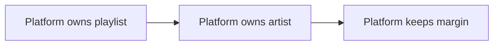
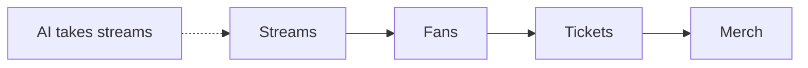

# Episode 5: How AI and TikTok Are Breaking the Music Industry (Rick Beato)

Guest: Rick Beato, music educator and YouTuber. Honest note on fidelity: this is a two-hour music-industry episode. The AI material runs through it in segments, not as the whole subject. This chapter covers every AI segment fully and skips the pure music-shop talk, which is not this track's subject.

The episode's AI question: what happens to music when the machines can make it, the platforms can fake the artists, and nobody can draw the line?

## The episode in one paragraph

Beato describes AI music already flooding Spotify playlists. He recounts his 2023 Senate testimony arguing that fully generative AI works should not get copyright. He then tackles the impossible problem of drawing a line between AI-assisted and AI-made, and the platform incentive to replace paid artists with synthetic ones it owns.

### AI music is already on your playlists

Beato says Spotify already pushes AI music into playlists, and the tracks get millions of streams. Much of it is light jazz and atmospheric music: the background genres where nobody asks who made it. Then came the test of whether listeners accept foreground music from fake artists. His example is the Velvet Sundown, covered in detail in Episode 9. The pattern he names: an AI company, or the platform itself, tests listener acceptance with synthetic acts and watches what happens.

The key number is not in this episode's AI segment but in the next: the Sundown went from zero to 600,000 Spotify followers in a week. Beato's point here is the mechanism. Playlists are the distribution. If the platform controls the playlist and the artist is synthetic, the platform keeps the whole margin.

*Figure 1. Vertical integration in three steps: own distribution, own creation, keep the margin. AI Podcast Curriculum, Ep 05, Rick Beato, 2025-07-10. Source: original diagram from episode claims.*

### The Senate testimony

In 2023 Beato testified before the US Senate on AI. He was one of 19 people invited. The Senate held nine closed-door sessions. He sat in the seventh. The first session had Elon Musk, Bill Gates, and Mark Zuckerberg. His session mixed interest groups: SAG-AFTRA, Spotify people, label people, and him, there because of his videos on AI music.

His position, stated to the senators: nothing fully generative should be copyrightable. The logic is economic, not moral. Copyright creates the financial incentive to produce. If a fully AI-generated song gets copyright, companies gain a reason to flood the market with synthetic music and collect on it. Remove copyright from fully generative works and you remove the incentive at the root. No copyright, no catalog asset, no reason to manufacture a thousand fake bands.

This is the cleanest policy proposal in the whole track. It does not ban anything. It does not judge art. It changes the money.

| Rule | Incentive | Result |
|---|---|---|
| Copyright granted | Synthetic songs earn | Flood the market |
| Copyright denied | No asset to own | Flood loses its prize |

*Figure 2. Beato's lever: do not ban the music, bankrupt its business model. AI Podcast Curriculum, Ep 05, Rick Beato, 2025-07-10. Source: original table from episode claims.*

### The delineation problem

Then Beato admits the line will not hold, and this is the strongest part of the episode. If a real person prompts an AI song, then re-records it themselves with real instruments, who sues whom? The AI company could claim the melody came from its model. The human claims they prompted and performed it. Beato's image: the Spider-Man meme, two figures pointing at each other, each claiming the song.

He extends it to his own workflow. He uses AI programs constantly. His best YouTube title generator is Gemini, because Google owns YouTube's data and the model knows his titles. He prompts ten variations, takes the first half of one and the second half of another, and edits. Is that video title AI-generated? Partly. Does the part matter? Nobody could say where the human ends and the model begins.

The general form: somewhere between a quill with no source material and a full ChatGPT prompt sits almost all real creative work. Prompting itself counts as a skill now. Beato says good prompt craft is an art. So the law wants a bright line, and the practice offers only a gradient.

| Work | Human share | Machine share | Who owns it? |
|---|---|---|---|
| Quill, no source | 100% | 0% | The human |
| Prompt, edit, perform | Mixed | Mixed | Unclear |
| Full ChatGPT prompt | 0% | 100% | Unclear |

*Figure 3. The delineation gradient: the law wants yes or no, the practice gives percentages. AI Podcast Curriculum, Ep 05, Rick Beato, 2025-07-10. Source: original table from episode claims.*

### The vertical integration threat

The episode's darkest economic claim comes from Williamson, and Beato agrees. Record labels may get a higher payout per stream than independent artists. [uncertain] Beato says he was sent this information and does not verify it in the episode. Treat the rate gap as alleged, not established. If the gap is real, the incentive is obvious: bypass the labels entirely with AI artists the platform controls.

The full version is vertical integration. Spotify would own distribution (the playlists), creation (the AI artists), and the margin between them. Williamson's analogy: it is like OnlyFans building its own AI girlfriends and cutting out the creators, the move described in Episode 8. When one company owns the factory, the store, and the customer relationship, the supplier's share goes to zero by construction.

Beato's open-loop fear: today it is background jazz. Tomorrow the top 10 has five AI acts. Every stream that goes to a synthetic artist is a stream a human artist needed to reach the critical mass for a live career. The record is the top of the funnel: ears first, then merch, then courses, then touring. AI takes the top of the funnel and the whole funnel starves.

*Figure 4. The funnel: AI competes at the top, the damage lands at the bottom. AI Podcast Curriculum, Ep 05, Rick Beato, 2025-07-10. Source: original diagram from episode claims. Dotted arrow marks the AI shock.*

### The counter-moves

Two defenses appear. First, disclosure and labeling: identify AI artists so listeners can choose. Beato is skeptical but notes the demand. Second, the human-only platform: a streaming service that guarantees no AI music, the organic-food model for ears. He finds it funny and plausible at once. The business model exists the moment enough listeners want it.

His personal move is already made: he does not use Spotify anymore, because it carries AI artists. Exit is a vote.

The episode also notes the barrier question. Williamson argues podcasting had a lower skill barrier than drumming, which is why musicians feel the AI threat more sharply. Beato's answer is honest: if we are not going to ban Midjourney images or NotebookLM podcasts, on what principle do we ban AI music? The delineation problem returns. You cannot fence one art form while the others flood.

## Q and A

**1. Explain Beato's copyright proposal like I am new to it.**
Copyright lets creators own and sell their work. Beato told the Senate that works made entirely by AI should not get copyright. Without copyright, a synthetic song is not an asset a company can own and monetize. The incentive to mass-produce fake artists disappears. The proposal fights the economics, not the technology.

**2. What is the delineation problem?**
The problem of drawing a legal line between AI-assisted and AI-made. A human prompts a song, then performs it with real instruments. Parts are human, parts are synthetic. The law wants a yes-or-no answer to "who made this?" The creative process offers only percentages. Beato's own title workflow with Gemini is the lived example: nobody can say where he ends and the model begins.

**3. What is vertical integration in the Spotify context?**
One company owning every layer: the AI that makes the music, the platform that distributes it, and the playlists that promote it. With no outside artist or label taking a cut, the margin stays inside. The episode's claim is that this structure makes human artists unnecessary by design, not by competition.

**4. Applied question: you run a small label. What do you do with this episode?**
You stop depending on playlist placement you do not control. You build the direct relationship: live shows, merch, courses, the funnel Beato describes where the record is only the top. You watch for disclosure rules, because labeled AI music helps human artists compete on authenticity. And you consider the human-only platforms early, before everyone else arrives.

**5. Why does Beato think the line cannot be drawn, even though he proposed one?**
Because his proposal targets the extreme case, fully generative works, while real practice lives in the middle. Prompting is a skill. Editing AI output is creative. Re-recording AI melodies is performance. Each step mixes human and machine beyond what a statute can separate. He proposes the rule for the clear case and admits the middle will stay contested.

**6. What is the open-loop fear?**
That there is no natural stopping point. Background AI jazz becomes foreground AI pop, which becomes AI acts in the top 10, which starves human artists of the streams they need to build live careers. Each step is small and defensible. The loop has no built-in brake. Beato's phrase "it is an open loop" means nobody designed an end state.

## Memory aids

**Mnemonic: C-D-V.** The three moves: **C**opyright denial, **D**elineation problem, **V**ertical integration. "Can Democratic Voters stop it?" Beato's answer: only the first is a real lever.

**Never-confuse pair: banning vs de-incentivizing.** A ban says nobody may make AI music. De-incentivizing says nobody can own it. Beato proposes the second. Bans need enforcement against everyone. Copyright denial just removes the prize.

**Never-confuse pair: the funnel top vs the funnel.** The record, the stream, the playlist slot: that is the top of the funnel. The live career, the merch, the teaching: that is the funnel. AI competes at the top. The damage lands at the bottom, where the human career actually lives.

**Trap card: "Just label AI music and the problem is solved."** Labels help listeners choose, but they do not fix the economics. A labeled synthetic artist still takes the stream, still starves the funnel, still pays no human. Disclosure is information. The problem is incentives.

**Trap card: "Prompting is not a real skill."** The episode's answer is that prompting qualifies as exactly that, and Beato's own workflow proves it. Dismissing the skill does not make the delineation problem go away. It makes your policy dumber.

## How to imbibe this

This week, do three things. First, check your own playlists for AI artists. Look up two acts you stream on autopilot, the background jazz, the atmospheric focus music. Find out who made them. If you cannot find a human, you have met the flood. Second, apply the delineation test to your own AI use. Pick one work task where you used AI this week. Write the percentage you would assign to the machine versus yourself. Notice how arbitrary the number feels. That feeling is the policy problem. Third, follow the money on one platform you use. Who gets paid when you stream, and what share? Write the chain in three links. If a link is absent, that is where the vertical integration will happen.

Catch yourself when you demand a bright line for AI art. The episode's lesson is that the line does not exist in practice. Ask instead which lever changes the money, because the money is what the platforms obey.

One observable behavior change: before you share an AI-generated song or image, you check whether it is labeled, and you say so when you share it. Disclosure starts with you.

## Think it yourself

Semi-guided drills. Brain first.

**Drill 1: the copyright arithmetic.** A synthetic artist gets 10 million streams at 0.4 cents per stream. What is the revenue? (Answer: 40,000 dollars.) Now suppose 1,000 such artists. What is the total? Now suppose the platform owns all of them and pays no royalties. What did the platform just capture? Write what this implies about the incentive to disclose.

**Drill 2: draw your own line.** Write a one-sentence law that defines "fully generative" tightly enough to enforce. Then attack it with three cases: prompted then re-recorded, AI melody with human lyrics, human melody with AI production. Rewrite the law after each attack. Count how many rewrites it takes before you give up. That count is the delineation problem as personal experience.

**Drill 3: the funnel map.** Draw the funnel for a musician: stream to fan to ticket to merch. Mark where AI competes at each stage. Then draw the funnel for your own profession. Mark the same stages. Write which stage of your funnel is the "background jazz" that goes first.

**Drill 4: argue both sides.** Side A: "AI music democratizes creation, the gatekeepers deserved to fall." Side B: "AI music centralizes power in the platforms, the artists were the democracy." Give each side two arguments from the episode and one of your own. Then name the fact that would settle it for you.

## Skills you can now use

You can now state Beato's copyright proposal and its economic logic. You can explain the delineation problem with the Spider-Man meme and the Gemini title workflow. You can map Spotify's vertical integration incentive in three layers. You can describe the open loop and the funnel starvation mechanism. You can argue for and against AI music bans using the episode's own honesty about the line. You can spot the "background genres first" pattern in any creative industry.

## Chapter plate

| Platform without rules | The stored object | Platform with copyright denial |
|---|---|---|
| Synthetic artists fill playlists, labels bypassed, human funnel starves, nobody knows who made what | The incentive: own the song, own the margin | Fully generative works unownable, flood loses its prize, human artists compete on the funnel they own |
| **Tradeoff in one line:** you cannot ban the technology, but you can bankrupt its business model. |

*Figure 5. Chapter plate. AI Podcast Curriculum, Ep 05, Rick Beato, 2025-07-10. Source: original synthesis of episode claims.*

Plate numbers restate episode figures. No new computation is made on this plate.

## Figure audit

Every state-changing claim below maps to one figure. No cell is blank. Symbols are defined in the track [symbol table](_symbols.md).

| Unit id | Claim | Before | After | Figure id | Medium | Source | 4 tests |
|---|---|---|---|---|---|---|---|
| u01 | Vertical integration lets the platform keep the margin | Platform rents artists | Platform owns artist and playlist | Fig 1 | Mermaid | Episode claims | Looks: 3-node chain. Shape: ownership layers force a chain. Number: margin share kept. Symbol: margin, reused in chapter plate. |
| u02 | Copyright denial bankrupts the flood | Synthetic songs earn | No copyright, no asset, no flood | Fig 2 | Table | Episode claims | Looks: 2-row table. Shape: rule-to-outcome mapping forces a table. Number: revenue per stream, 0.4 cents. Symbol: lever. Terminal: no later reuse. |
| u03 | The delineation line is a gradient | Law wants yes or no | Practice gives percentages | Fig 3 | Table | Episode claims | Looks: 3-row gradient. Shape: a spectrum forces ordered rows. Number: human share of the work. Symbol: gradient, reused in ep09 Fig 3, chapter plate. |
| u04 | AI starves the funnel from the top | Streams feed the career | AI takes streams, career starves | Fig 4 | Mermaid | Episode claims | Looks: 4-node funnel plus shock arrow. Shape: a funnel plus one cut forces this layout. Number: streams for critical mass. Symbol: funnel, reused in chapter plate. |
