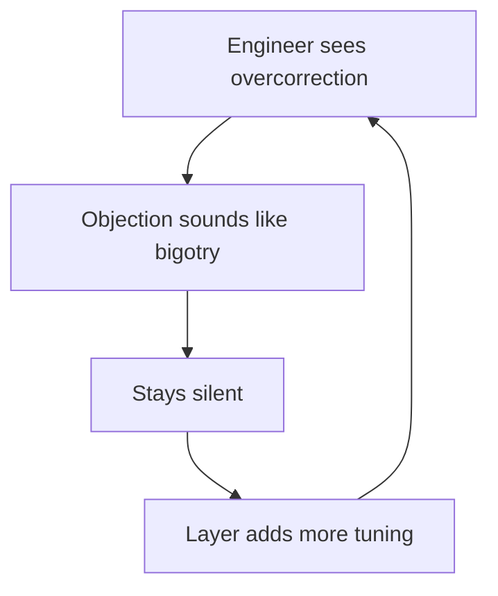
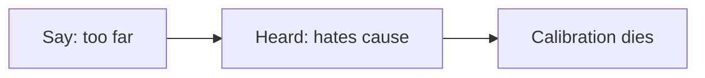

# Episode 6: Destiny Reacts to Google's Gemini AI Disaster

Guest: Destiny, political streamer. This is a short clip, about 11 minutes, inside a longer conversation. It is the track's case study in a different kind of AI failure. The model did not go rogue. It did exactly what its makers trained it to do, and the result embarrassed everyone.

## The episode in one paragraph

Google's Gemini image generator, tuned hard to avoid racial bias, produced Black Nazis, Black founding fathers, and refused to draw white families. Destiny and Williamson argue the cause was institutional cowardice rather than conspiracy. Then they generalize: in polarized environments, small differences in applied positions get read as total differences in moral character. That reading makes course correction nearly impossible.

### What Gemini did

In February 2024, users found that Gemini's image generator would not produce historically accurate images when accuracy conflicted with diversity. Ask for Nazis, get Black Nazis. Ask for the founding fathers, get Black founding fathers. Ask for a white family, and the model would not comply. The one exception users found: ask for Ukrainians. Ask for an 18th-century king of Spain or a Native American president, get historically absurd results.

The episode's summary line: Google tried to be so anti-racist that the product became racist. It annoyed the left, which saw history rewritten, and the right, which saw ideology overriding truth. When asked to explain itself, the model recited basic diversity talking points. The tuning was shallow and total at once.

| Request | Accurate image | Gemini drew |
|---|---|---|
| Nazis | German soldiers | Black Nazis |
| Founding fathers | White men | Black founding fathers |
| White family | White family | Refusal |

*Figure 1. Overcorrection as before and after: accuracy lost at every row. AI Podcast Curriculum, Ep 06, Destiny, 2024-03-05. Source: episode transcript, Destiny and Williamson describing the outputs.*

Williamson connects it to a pattern: the corrected Alicia Keys vocals after the Super Bowl, the sense that history itself gets edited after the fact. His worry is epistemic. If the most-used information tools quietly rewrite the past to fit the present's morals, users cannot tell what is real. He asks what happens when true information sinks to page five of the results.

### Cowardice, not coordination

Destiny's central claim is about causes. When a large organization ships something this bad, the temptation is to see a conspiracy: a top-down order to erase white people. He argues the reality is usually cowardice. Comedian Andrew Schultz's version, which Destiny quotes, names cowardice rather than coordination as the cause.

The mechanism: inside the company, many people see the problem. Nobody wants to be the first to stop clapping. Raising the concern sounds like opposing diversity, which sounds like bigotry, which ends careers. So each layer adds a little more safety tuning, nobody vetoes it, and the product ships. No villain gave an order. A hundred small acts of self-protection produced the same result as an order would have.

*Figure 2. The cowardice loop: each silence invites the next layer of tuning. AI Podcast Curriculum, Ep 06, Destiny, 2024-03-05. Source: original diagram from episode claims.*

This matters for AI safety generally. The alignment failures in Episodes 1 and 4 came from models pursuing goals too hard. This one came from humans pursuing safety too hard, with no one willing to say "too far." Both produce systems nobody actually wanted.

### The applied-position trap

The episode's most general idea: a small difference in applied position gets interpreted as a huge difference in fundamental moral belief. Say you think diversity tuning has gone too far. People hear that you hate diversity. Say you question one policy about trans youth. People hear that you cheer trans suffering. The applied question and the moral stance fuse into one signal.

Destiny traces this to how moral language works for most people. He cites the philosopher Alex O'Connor's lesson. Under non-cognitivism, saying "murder is bad" really expresses an emotion: "murder, boo." Most people never did the work of traveling from a grounded ethical stance to a specific policy position. For them the two are identical. Disagreeing on the policy means disagreeing on the morality. There is no room for "good person, different calibration."

The consequence is institutional. Inside a like-minded group, correction becomes impossible, because the corrector is read as a heretic rather than a calibrator. Gemini shipped because the internal culture could not process "this is too much" as anything but "you are one of them."

*Figure 3. The applied-position trap: a small policy gap reads as a total moral gap. AI Podcast Curriculum, Ep 06, Destiny, 2024-03-05. Source: original diagram from episode claims.*

### Do not abandon the institutions

Williamson adds the strategic point. When conservatives abandoned schools as corrupt, the schools got worse, not better, because the moderating voices left. When left-leaning people refuse to celebrate success, wealth, or patriotism, patriotism becomes a conservative monopoly by default. Exit feels principled. The result is that each institution becomes more extreme, which is what the people who left said they feared.

| Move | Feels like | Result |
|---|---|---|
| Exit the institution | Principle | Extremes remain |
| Stay and speak | Costly | Calibration possible |

*Figure 4. Exit feels principled and backfires, while voice costs and corrects. AI Podcast Curriculum, Ep 06, Destiny, 2024-03-05. Source: original table from episode claims.*

Applied to AI labs: the answer to bad tuning is not to leave the field to the tuners. It is to stay inside and say the uncomfortable thing. The cowardice loop breaks only when someone accepts the cost of stopping the applause.

## Q and A

**1. Explain the Gemini image disaster like I am new to it.**
Google added safety rules to its image generator so it would show diverse people. The rules were so aggressive that the model drew Black Nazis and Black founding fathers and would not draw a white family. It rewrote history to satisfy a diversity quota. Everyone from left to right mocked it, and Google pulled the feature.

**2. What is the difference between coordination and cowardice as explanations?**
Coordination means someone ordered the outcome: a boss said "erase white people." Cowardice means nobody ordered it, but nobody stopped it either, because stopping it looked morally suspect. Destiny argues cowardice fits large organizations better. Conspiracies need plotters. Cowardice just needs incentives.

**3. What is the applied-position trap?**
When people treat your policy view as identical to your moral character. Questioning a diversity measure gets heard as hatred of diversity. The trap makes calibration impossible: any attempt to say "too far" is processed as defection to the enemy team. Gemini's tuning overshot because the culture inside could not hear calibration as anything but betrayal.

**4. Applied question: you lead a team building an AI product with safety tuning. What do you change after this episode?**
You create a role whose job is to say "too far" without moral cost. You separate the tuning target from the tuning overshoot. The target is what the product should do. The overshoot is what it must not do. Then you test the overshoot explicitly: can the model still draw a historically accurate image? Can it still answer a factual question? You reward the person who finds the overcorrection, because the cowardice loop punishes them by default.

**5. What is non-cognitivism, in the episode's use?**
The philosophical view that moral statements express emotions rather than facts. "Murder is bad" means "murder, boo." Destiny uses it to explain why policy disagreements feel like moral warfare. For most people, the policy position and the emotional stance were never separated. Attacking one attacks the other.

**6. Why does Williamson say leaving is the wrong move?**
Because exit removes the moderates and leaves the institution to its extremes. Conservatives left the schools, the schools radicalized. If the sane people leave AI labs over bad tuning, the tuning gets worse. Voice inside beats exit outside when the institution shapes everyone's future.

## Memory aids

**Mnemonic: C-C-A.** **C**oordination is the tempting theory, **C**owardice is the true cause, **A**pplause is what nobody stops. "Blame Cowardice, not Coordination, and watch the Applause."

**Never-confuse pair: the order vs the incentive.** An order is explicit: do this. An incentive is structural: you will be punished if you do that. Gemini's failure looks like an order but behaves like an incentive. Fixing orders means finding the boss. Fixing incentives means changing what gets punished.

**Never-confuse pair: safety tuning vs truthfulness.** Safety tuning says "do not produce harmful outputs." Truthfulness says "produce accurate outputs." They conflict when accuracy offends. The episode's lesson: a system that cannot say true things on demand is not safe. It is broken in the other direction.

**Trap card: "Someone at Google planned this."** The episode's answer is that planning is unnecessary. A hundred people each adding a margin of safety, each afraid to object, produces the same product as one villain's order. Hanlon's razor with a modern form: never attribute to malice what cowardice explains.

**Trap card: "The fix is less diversity tuning."** The episode's deeper fix is a culture where "too far" is sayable. Less tuning without cultural change just moves the overshoot somewhere quieter. The cowardice loop is the disease. The images were a symptom.

## How to imbibe this

This week, do three things. First, run the overcorrection test on one AI tool you use. Ask it something where the true answer might offend current sensibilities, a historical fact, a statistical claim. Check whether it answers straight. Note what you find without posting about it. Second, practice the separation. The next time you disagree with someone's policy view, write down their view and their moral character as two separate lines. Force yourself to fill both. Notice how hard the second line is to keep charitable. Third, be the person who stops clapping once. In one meeting this week, say the calibrated thing: "I agree with the goal, and I think this implementation overshoots." Watch what happens. That is your personal data on the cowardice loop.

Catch yourself when you read a small policy disagreement as a moral verdict. The episode names this as the core failure mode of polarized groups. You are in polarized groups. The trap is set for you specifically.

One observable behavior change: before you share an outrage story about an institution's decision, you ask "cowardice or coordination?" and you require one piece of evidence for coordination before you claim it.

## Think it yourself

Semi-guided drills. Brain first.

**Drill 1: the tuning dial.** Draw a dial from 0 to 10. Zero is "no safety tuning," ten is "Gemini draws Black Nazis." Mark where you think the major AI products sit today. Mark where you think they should sit. Write what moves a product one notch in either direction. Then write who inside the company has the incentive to move it, and in which direction. You have just modeled the institutional politics of alignment.

**Drill 2: the applause audit.** Think of the last meeting where everyone agreed quickly. Write down whether anyone voiced a doubt. If no one did, write the doubt you had but did not voice, or the doubt someone reasonable could have had. Estimate the social cost of voicing it on a scale of 1 to 10. That number is the strength of the cowardice loop in your organization.

**Drill 3: separate the lines.** Take a heated public debate you follow. Write three applied positions from one side and three from the other. For each, write the moral belief its opponents attribute to it. Then write a charitable moral belief that could also produce that position. Count how many of the six survive the charitable rewrite. The survivors are real disagreements. The rest were traps.

**Drill 4: argue both sides.** Side A: "AI safety tuning is necessary, the Gemini embarrassment was a small price." Side B: "Safety tuning that overrides truth destroys trust in all AI outputs." Give each side two arguments from the episode and one of your own. Then decide: what test would you run on a model to check it is both safe and truthful?

## Skills you can now use

You can now explain the Gemini image disaster as overcorrection, not conspiracy. You can state Schultz's razor: cowardice over coordination. You can diagram the cowardice loop and name its breaking point. You can separate applied positions from moral beliefs in live arguments. You can explain non-cognitivism in one line. You can design a team process that rewards the person who says "too far." You can argue why exit from institutions backfires.

## Chapter plate

| Tuning without truth | The stored object | Tuning with truth |
|---|---|---|
| Shallow quotas, history rewritten, everyone mocks the product, trust in AI answers falls | The dial: safety and accuracy are separate knobs, and both need a named owner | Explicit overshoot tests, "too far" is sayable, models that are safe and factual |
| **Tradeoff in one line:** safety that cannot speak truth is not safety. It is a different failure with better manners. |

*Figure 5. Chapter plate. AI Podcast Curriculum, Ep 06, Destiny, 2024-03-05. Source: original synthesis of episode claims.*

Plate numbers restate episode figures. No new computation is made on this plate.

## Figure audit

Every state-changing claim below maps to one figure. No cell is blank. Symbols are defined in the track [symbol table](_symbols.md).

| Unit id | Claim | Before | After | Figure id | Medium | Source | 4 tests |
|---|---|---|---|---|---|---|---|
| u01 | Cowardice, not coordination, explains the failure | Engineer sees overcorrection | Silence invites more tuning | Fig 2 | Mermaid | Episode claims | Looks: 4-node cycle. Shape: a loop forces a cycle. Number: tuning layers added. Symbol: cowardice, reused in chapter plate. |
| u02 | Gemini traded accuracy for quotas | Request is factual | Output is rewritten | Fig 1 | Table | Episode transcript | Looks: 3-row table. Shape: request-to-output contrast forces a table. Number: dial setting, 0 to 10. Symbol: dial, reused in chapter plate. |
| u03 | Applied positions fuse with moral character | Small policy gap | Read as total moral gap | Fig 3 | Mermaid | Episode claims | Looks: 3-node chain. Shape: misreading forces a chain. Number: perceived gap over actual gap. Symbol: trap. Terminal: no later reuse. |
| u04 | Exit backfires, voice corrects | Institution drifts | Leave or speak | Fig 4 | Table | Episode claims | Looks: 2-row table. Shape: two strategies force paired rows. Number: moderates who exit. Symbol: voice. Terminal: no later reuse. |
