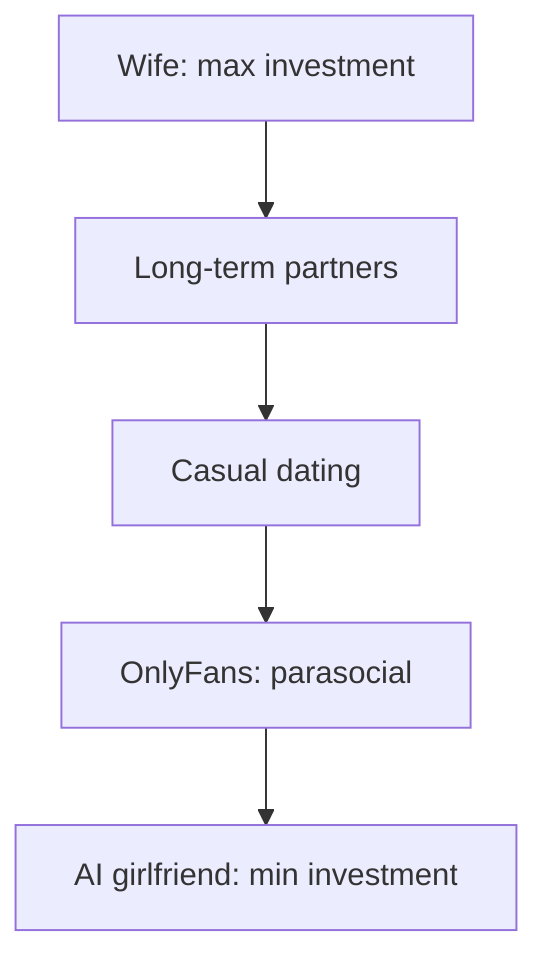
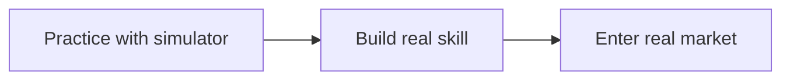

# Episode 8: OnlyFans Models Have Their Jobs Threatened by AI Girlfriends

Guest: William Costello, evolutionary psychologist and researcher of incel communities. The captions give his first name only and describe him as an evolutionary psychologist. Episode listings for his Modern Wisdom appearances confirm the full name. This episode is the science behind Episode 3's comedy. Read Episode 3 first. The prestige argument gets its full derivation here.

## The episode in one paragraph

Costello and Williamson ask whether AI girlfriends, image generators plus ChatGPT-level conversation, will displace OnlyFans creators. The answer runs through parasocial economics, the whoriarchy, biophilia, supernormal stimuli, and the male sedation hypothesis. It lands in two places: AI can fake attention but not selection, and the same technology could become a training ground that makes men more competent at real courtship.

### The product and the puzzle

The premise: image models will soon generate women hotter than reality, and language models will soon do dirty talk better and more attentively than real people. The question is whether OnlyFans creators are the first AI-displaced workforce.

The puzzle that opens the inquiry: free hardcore pornography of every variety already exists, unlimited. Male desire leans strongly toward novelty and variety. So why did OnlyFans explode at all? Why do men pay for one creator when infinite variety costs nothing?

Costello's answer: the itch is different. Buyers pay for the **parasocial relationship**: the feeling of capturing the star's attention, the personalized clip where she says your name, the thirty seconds that feel like she chose you. Porn made for the masses cannot sell that. The purchase is personal attention, not images.

### The Laura Lux objection and why it is partly right

Creator Laura Lux posted the sharpest version of the defense: people do not subscribe to see a random naked woman. They subscribe to see her, specifically, because of a parasocial bond built on her other platforms. Williamson calls this partly cope. His counter: if AI can already generate the social-media content that builds the parasocial bond in the first place, then the bond itself can be synthesized. The defense assumes the relationship is real. The technology attacks that assumption directly.

The honest synthesis: Lux is right about what the market sells (a specific person, not generic images) and wrong that specificity protects it. An AI can be specific too. What it cannot be is selective, which is the next section's point.

### The whoriarchy

Costello introduces the **whoriarchy**, a concept from sex-work economics. Humans have always paid for sex, when researchers gave chimpanzees currency, the first purchase was sex. The whoriarchy ranks sexual arrangements by cost and commitment. At the top sits the wife: maximum investment, maximum commitment. At the bottom sits the sex worker: minimum investment. Everything else arrays between.

The concept does two jobs in the episode. First, it normalizes the market: paid intimacy is ancient, and AI girlfriends are a new entrant at the bottom of the ladder, cheaper than everything above. Second, it explains the resistance. Women, in this account, resist technologies that lower the market value of what the female side of the market sells. The resistance to AI girlfriends looks like moral concern but functions as **intersexual competition**: protection of market position. Costello is blunt that this dynamic, not principle, drives much of the opposition.

*Figure 1. The whoriarchy: paid intimacy ranked by cost, with the AI girlfriend at the bottom. AI Podcast Curriculum. Source: original diagram from episode claims via Costello.*

### Biophilia: the resistance to the unnatural

**Biophilia** is the innate human pull toward the natural, the feeling that what is natural is best. Costello gives two test cases. Lab-grown meat is real meat with no slaughter, yet people feel more squeamish about the petri dish than about the killed animal. Artificial wombs could end maternal death. About 300,000 women die in childbirth or pregnancy each year. Yet when Williamson polled his followers, only 16 percent of female respondents favored the technology and 15 percent opposed it outright. [uncertain] The poll numbers are reported speech from the episode, from an informal Twitter poll. Treat them as anecdote, not data.

The point: even technologies that reduce suffering face deep resistance when they detach us from nature. AI girlfriends get the same resistance. The opposition is not computed from harms and benefits. It is felt, then rationalized.

### Supernormal stimuli: the jewel beetle

The episode's most vivid science is **supernormal stimuli**, from the ethologist Nikolaas Tinbergen. A stimulus can provoke a stronger response than the real thing it imitates. Tinbergen's birds preferred an exaggerated red dot to the real marking. The extreme case: male jewel beetles try to mate with discarded beer bottles because the bottles exaggerate the cues of a female beetle's rear end. The males choose bottles over real females. The fake outcompetes the real.

| Tinbergen case | Cue exaggerated | Human case |
|---|---|---|
| Birds, red dot | Marking | Men, rendered bodies |
| Beetles, bottle | Mating signal | Men, AI girlfriend |

*Figure 2. The supernormal mapping: the fake beats the real when it exaggerates the cue. AI Podcast Curriculum. Source: original table from episode claims.*

The question Costello poses: are AI girlfriends a supernormal stimulus for male mating psychology? Pornography alone never quite did it, men with unlimited porn still pursue real partners. But the combination, perfectly rendered bodies plus perfectly attentive conversation plus virtual embodiment, might cross the threshold where the synthetic beats the real the way the bottle beats the beetle. Virtual reality plus AI conversation is the experiment currently running on a generation.

### The male sedation hypothesis

Why are young men, more sexless than ever, not revolting? Costello's candidate answer is the **male sedation hypothesis**: porn, games, and now AI companions pacify the demographic that history says would otherwise destabilize society. The alternative to a million listless men with AI girlfriends is bands of high-testosterone risk-takers on the move. The episode is darkly honest that the pacified version is better for social stability, even if it is bleak for the men.

But the sedation is incomplete. The men do not look happy. Online you see hopeful talk about sex robots arriving soon, which reads as hope, not satisfaction. Something remains unmet. Costello's guess at the missing thing: the desire to be **selected**. Status, prestige, the difficulty of winning a mate. These are not bugs in the mating market. They are the market. A product everyone can have confers nothing, which is why the AI girlfriend soothes without satisfying.

| Technology | Pacifies | Leaves men happy |
|---|---|---|
| Porn and games | Yes | No |
| AI companions | Yes | No |

*Figure 3. Sedation is not satisfaction: the products pacify without fulfilling. AI Podcast Curriculum. Source: original table from episode claims.*

### The white pill: the training ground

The episode's surprise is optimism. The same properties that make AI girlfriends low-status make them perfect practice. Nobody's feelings get hurt when you fail with software. So build the sandbox: a young man practices conversation, reading cues, even physical competence, against a simulator, then takes the skills to the real market where status actually lives.

Williamson loves the sports analogy. Nobody walks onto the field for the championship without practice. Cricketers face bowling machines. Fighters hit bags. But in mating, the most high-stakes performance of a young man's life, there is no batting cage, because practicing on real women costs real feelings. The AI girlfriend is the batting cage. The status waiting on the other side, a real relationship, supplies the motivation the simulator cannot.

*Figure 4. The batting cage: practice where failure is free, status where it counts. AI Podcast Curriculum. Source: original diagram from episode claims.*

The predicted market structure: **stratification**. Some men compete in the real world for real status. Others get drunk on the virtual world's stimulation and stay. People move between the layers across a lifetime, the way recovering alcoholics relapse and recover. The technology does not end the mating market. It sorts it.

One more economic note worth keeping: the agencies already run the scam. OnlyFans creators employ virtual assistants, in some cases overseas chatters, to fake the personal attention at scale. One creator with 21,000 paying subscribers and 3 million dollars a year cannot personally message anyone. The parasocial product was already synthetic before AI arrived. The code just replaces the chatters.

## Q and A

**1. Explain the whoriarchy like I am new to it.**
It is a ranking of sexual arrangements by cost. A wife costs the most in commitment and investment. A sex worker costs the least. Everything else sits between. The concept matters here because AI girlfriends enter at the very bottom: cheaper than every existing option. Markets respond to new bottom-rung entrants by repricing everything above them.

**2. What is a supernormal stimulus, and why does the beer bottle matter?**
A fake that triggers a stronger response than the real thing. Tinbergen's birds preferred exaggerated markings. Male jewel beetles prefer beer bottles to female beetles because the bottles exaggerate the mating cues. The bottle matters because it proves the fake can beat the real. The episode asks whether AI girlfriends are the beer bottle for human male psychology.

**3. What is the male sedation hypothesis?**
That cheap sexual technology pacifies young sexless men who might otherwise destabilize society. Porn, games, and AI companions absorb the energy that history turned into unrest. The hypothesis explains the dog that did not bark: record sexlessness without proportional revolt. The episode notes the sedation works but does not satisfy.

**4. Why does being selected matter more than the experience itself?**
Because status is positional. Value comes from difficulty and exclusivity: she chose you, not everyone. An AI girlfriend chooses everyone, so it cannot confer status no matter how good the simulation. Costello's claim is that the mating market runs on selection, and any product without selection sells a different good.

**5. Applied question: you design an AI dating coach. What does this episode tell you to build?**
Build the batting cage, not the girlfriend. The product is practice with feedback: conversation reps, cue reading, rejection without cost. The design must point outward, toward real-world status, because status is the motivation the simulator cannot supply. Measure success by real dates, not by app engagement. Engagement without graduation is the sedation business.

**6. What is biophilia doing in this argument?**
It explains why rationally beneficial technologies face irrational resistance. Lab meat ends slaughter, artificial wombs end maternal death, AI companions end exploitation, and all three get resisted. The resistance comes from the felt wrongness of the unnatural, not from a harm calculation. Any forecast of adoption that ignores biophilia will overshoot.

**7. What does the Her movie scene illustrate?**
In the film, the protagonist learns his AI girlfriend talks to 86,000 others simultaneously. The scales fall from his eyes. The scene dramatizes the selection problem: the relationship felt personal until the scale became visible. It is the episode's parable for what happens when users confront that they are one of thousands.

**8. How does this episode change Episode 3's prestige argument?**
Episode 3 stated it as comedy wisdom: no prestige, no replacement. This episode derives it from evolutionary psychology, market structure, and neuroscience, then adds the two twists Episode 3 lacked: the whoriarchy's intersexual-competition account of the resistance, and the training-ground white pill. Same conclusion, deeper foundations, one new hope.

## Memory aids

**Mnemonic: B-S-W.** The three sciences: **B**iophilia, **S**upernormal stimuli, **W**horiarchy. "Beer, Sex, Wombs": the bottle, the market, the poll.

**Never-confuse pair: sedation vs satisfaction.** Sedation pacifies. Satisfaction fulfills. AI companions sedate effectively and satisfy poorly. The gap between the two is the whole episode. A product can succeed at the first while failing at the second, and the market will not tell you which one you bought.

**Never-confuse pair: the parasocial product vs the sexual product.** OnlyFans sells the feeling of being noticed. Porn sells images. They are different goods with different economics. AI attacks the second easily and the first only by faking it. Every forecast that treats them as one market is wrong.

**Trap card: "AI girlfriends will end loneliness."** The episode's answer: they end aloneness, not loneliness. Company without selection does not meet the need the need names. The men look pacified and still unhappy. Loneliness is a status hunger, not a contact hunger.

**Trap card: "The training ground justifies everything."** The white pill is real but narrow. A simulator teaches skills only if the user wants the real game. For users who prefer the simulator, it serves as the destination, not as training. The same product is a batting cage for some and a bottle for others.

## How to imbibe this

This week, do three things. First, find your own supernormal stimulus. Name one product in your life that exaggerates a natural cue: sugar, social media likes, porn, games. Write the natural cue and the exaggeration in two lines. Notice that you prefer the exaggeration. That preference is the beetle in you. Second, audit one parasocial relationship you hold: a creator you follow, a streamer you tip. Write what you get from it in one line, then ask whether a perfect AI copy would give you the same thing. Your hesitation locates the selection premium. Third, practice the training-ground principle somewhere safe. Pick one high-stakes skill you avoid, difficult conversations, public speaking, and build yourself a simulator: rehearsal, role-play, low-stakes reps. The episode's white pill generalizes.

Catch yourself when you consume the synthetic version of something and call it the real thing. The episode's discipline: name which good you actually bought: content, attention, selection, or status. Most confusion in this market comes from mislabeling the purchase.

One observable behavior change: the next time you feel the pull of a supernormal product, you name the natural cue it hijacks before you indulge. Naming the hijack does not always stop it. It always weakens it.

## Think it yourself

Harder drills. First principles. Minimal scaffolding.

**Drill 1: price the whoriarchy.** Assign rough dollar values to five rungs of the ladder, from marriage to AI girlfriend, as lifetime costs. Do not aim for accuracy. Aim for ordering. Now introduce a free, perfect AI companion. Which rungs lose value first? Write the cascade in order and the mechanism per rung. You modeled technological displacement in a status market.

**Drill 2: design the bottle test.** Tinbergen proved supernormal stimuli in birds. Design an ethical experiment to test whether AI companions are supernormal for humans. Name your subjects, your control, your measured outcome, and the line that would convince you. Then write why the experiment will never run. The gap between the design and the reality is where science meets ethics.

**Drill 3: the selection conservation law.** Propose this law: status cannot be created, only transferred. Test it against three cases: a degree, a championship, an AI girlfriend. Where does the law hold? Where does it break? Write the refined version of the law after testing. You do conceptual engineering on the episode's core claim.

**Drill 4: argue both sides, then live it.** Side A: "AI companions are the humane answer to mass male loneliness." Side B: "AI companions are the coward's answer, and they dissolve the species." Give each side its strongest case from the episode. Then write which world you would choose for someone you love, and what that choice reveals about your own values.

## Skills you can now use

You can now explain parasocial economics and why free content did not kill paid attention. You can define the whoriarchy and use it to predict market repricing. You can define biophilia and forecast resistance to beneficial technologies. You can explain supernormal stimuli with the jewel beetle and apply it to AI products. You can state the male sedation hypothesis and its limits. You can design a training-ground product that points at real status. You can separate sedation from satisfaction in any comfort technology.

## Chapter plate

| Attention without selection | The stored object | Practice toward selection |
|---|---|---|
| Synthetic companions soothe, the whoriarchy reprices, men sedated but unsatisfied, the bottle beats the beetle | Selection: the scarce good no simulator can mint | Batting-cage AI builds real skill, status waits in the real market, stratification sorts the motivated from the sedated |
| **Tradeoff in one line:** the same technology is a bottle for the user who stays and a batting cage for the user who leaves. |

*Figure 5. Chapter plate. AI Podcast Curriculum. Source: original synthesis of episode claims.*

Plate numbers restate episode figures. No new computation is made on this plate.

## Figure audit

Every state-changing claim below maps to one figure. No cell is blank. Symbols are defined in the track [symbol table](_symbols.md).

| Unit id | Claim | Before | After | Figure id | Medium | Source | 4 tests |
|---|---|---|---|---|---|---|---|
| u01 | The whoriarchy ranks paid intimacy by cost | Wife at top | AI girlfriend at bottom | Fig 1 | Mermaid | Episode claims via Costello | Looks: 5-node ladder. Shape: a ranking forces a ladder. Number: rungs, 5. Symbol: ladder, reused in chapter plate. |
| u02 | Supernormal stimuli beat the real thing | Real female beetle | Male chooses the bottle | Fig 2 | Table | Episode claims | Looks: 2-row mapping. Shape: analogy forces paired rows. Number: exaggeration factor of the cue. Symbol: stimulus, reused in chapter plate. |
| u03 | Sedation is not satisfaction | Men pacified | Men not happy | Fig 3 | Table | Episode claims | Looks: 2-row table. Shape: pacify-versus-fulfill forces a table. Number: hours per day on the synthetic. Symbol: user. Terminal: no later reuse. |
| u04 | The simulator is a batting cage | No practice exists | Practice with feedback, then the real market | Fig 4 | Mermaid | Episode claims | Looks: 3-node chain. Shape: training order forces a chain. Number: practice reps before the real attempt. Symbol: selection, reused from ep03 Fig 1, chapter plate. |
