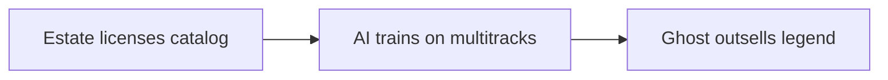

# Episode 9: It Is Happening… AI Bands Are Taking Over Spotify (Rick Beato)

Guest: Rick Beato, returning from Episode 5. This is a short clip, under nine minutes, and it works as the sequel. Episode 5 described the flood coming. This episode names the first band to ride it.

## The episode in one paragraph

A supposedly AI-generated band called the Velvet Sundown got Spotify's verification checkmark, gathered 600,000 followers in a week, and announced a second record, with no verifiable humans behind it. Beato restates his copyright position, poses the authorship paradox, and predicts licensed AI versions of dead legends that some fans will prefer to the originals.

### The Velvet Sundown

The facts as Beato reports them: the Velvet Sundown appeared on Spotify with AI-looking photos and AI-sounding songs. Spotify gave the act a verified symbol, the checkmark that normally means "this is really this artist." The follower count went from zero to over 600,000 in a week. A second record was announced for two weeks later. Nobody came forward to claim it. No record of the supposed members exists. The bio reads like fiction. Commenters on Beato's video suspect bots inflate the numbers.

Beato's read: someone tests whether the public accepts AI music. The candidate testers are an AI music company, Spotify itself, or a partnership between them. The test already returned its first result. People streamed it. Whether they knew it was synthetic barely mattered.

| Measure | Value |
|---|---|
| Followers gained | 600,000 |
| Days | 7 |
| Per day | 85,714 |
| Per hour | 3,571 |

*Figure 1. The Sundown's first week as arithmetic: 600,000 divided by 7 days. AI Podcast Curriculum, Ep 09, Rick Beato, 2025-07-06. Source: computed from episode figures. 600,000 / 7 = 85,714 per day, and that / 24 = 3,571 per hour.*

The verification checkmark is the detail to sit with. Verification exists to solve impersonation: this account is really the person it claims. A verified synthetic artist breaks the concept. The checkmark now certifies that Spotify does not know or does not care who is behind the music.

| Signal | What it normally means | What it meant here |
|---|---|---|
| Verified checkmark | A real artist's real account | A synthetic act's real account |
| 600,000 followers in a week | Organic breakout | Possibly bots, possibly curiosity |
| Second record in two weeks | A working band | A working pipeline |

*Figure 2. Every trust signal, inverted: verification, followers, and output all meant the opposite. AI Podcast Curriculum, Ep 09, Rick Beato, 2025-07-06. Source: original table from episode claims.*

### The copyright position, restated

Beato repeats his Senate testimony line from Episode 5: nothing fully generative should be copyrightable. The episode adds the enforcement paradox that makes the position hard to apply. Take an AI-prompted song, re-record it yourself with real instruments and real tracks. Now who owns it? The AI company says its model generated the melody. You say you prompted and performed it. Beato's image is the Spider-Man meme: two figures pointing at each other, each claiming the song.

| Claimant | Claim |
|---|---|
| AI company | The melody came from our model |
| Human | I prompted and performed it |

*Figure 3. The Spider-Man paradox: two authors point at each other. AI Podcast Curriculum, Ep 09, Rick Beato, 2025-07-06. Source: original table from episode claims.*

The paradox generalizes. If the law denies copyright to AI works but cannot tell AI works from human ones, the rule is unenforceable. If the law grants copyright to prompters, it rewards the flood. Every version of the rule fails somewhere. Beato does not resolve this. He presents it as the open problem his Senate proposal cannot close alone.

### Originality is just undetected plagiarism

Williamson contributes the episode's philosophical line, quoting William James: "originality is just undetected plagiarism." The argument: nobody creates from nothing. The saxophone player holds the instrument the way teachers taught. The drummer uses the kick and snare in the standard pattern because the pattern works. Every song, book, and film is recombined influence.

AI lifts the veil. What used to be untraceable influence is now detectable derivation. The model trained on everything, and the output can be checked against the training data. The discomfort is not that AI copies. It is that AI makes visible what humans always did. The plagiarism panic is really a transparency panic.

### The licensed ghosts

Beato's prediction: the estates and publishers will license AI versions of dead legends. The Beatles and Beatles AI. Prince and Prince AI. Michael Jackson and Michael Jackson AI. Trained on the multitracks, controlled by whoever owns the publishing, released as new material from artists who cannot object.

His sharpest claim: some fans will prefer the AI version. "I like Michael Jackson AI better than Michael Jackson" will be a real sentence someone says. At that point the debate about authenticity ends, because the market voted. Meritocracy of the ear: people vote with their ears, and the ears do not ask about the training data.

*Figure 4. The licensed ghost: the catalog becomes a competitor to itself. AI Podcast Curriculum, Ep 09, Rick Beato, 2025-07-06. Source: original diagram from episode claims.*

This is the endpoint of Episode 5's open loop. Not background jazz but foreground ghosts, competing directly with the originals, licensed by the same industry that once fought piracy.

## Q and A

**1. Explain the Velvet Sundown case like I am new to it.**
A band appeared on Spotify with AI-generated photos and songs. Spotify verified the account. It gained 600,000 followers in seven days. A second album was announced. No human members could be found. Nobody claimed ownership. It looks like a test of whether listeners accept synthetic artists, and the early answer is yes.

**2. Why does the verification checkmark matter so much?**
Verification is a trust primitive. It tells users "this is really the artist." A verified fake artist means the trust primitive now certifies fakes. Once users learn the checkmark does not guarantee a human, they must discount every verified account. One synthetic verification poisons the whole system.

**3. What is the Spider-Man meme paradox?**
You prompt an AI song, then re-record it with real instruments. The AI company claims the melody came from its model. You claim you created it through prompting and performance. Both point at each other. Copyright law needs one author. The creative process now has two. The meme captures a legal system pointing at itself.

**4. Applied question: you manage a living artist's catalog. What do you do with the licensed-ghost prediction?**
You decide early whether to license an AI version of your artist, because someone will propose it. The decision has three parts: the money (new revenue from synthetic releases), the brand (does the ghost dilute the legend?), and the precedent (your license teaches the market the price). Beato's prediction says refusal only delays the market. You price accordingly.

**5. What does "originality is just undetected plagiarism" mean here?**
That all creation recombines prior work, and AI only makes the recombination visible. The human composer borrows untraceably. The model borrows traceably. The moral difference people feel between the two is really a difference in auditability. The quote reframes the AI debate: the machine did not introduce copying. It introduced receipts.

**6. Why will some fans prefer the AI version of a dead legend?**
Because the AI version can be optimized for the listener: the best traits of the artist, none of the decline, endless new material in the familiar style. Preference follows pleasure, not provenance. Beato's point is that authenticity is a story listeners tell themselves until the synthetic version sounds better.

## Memory aids

**Mnemonic: V-C-P.** **V**elvet Sundown, **C**heckmark, **P**lagiarism quote. "Very Clever Pirates": the band, the broken trust signal, the philosophy.

**Never-confuse pair: the test vs the product.** The Sundown might be a marketing test, not a real band. But the test is the product: what the sellers sell is the data on listener acceptance. Every stream is a vote in someone's experiment. When you cannot tell test from artist, you are the lab rat.

**Never-confuse pair: detectable vs undetectable influence.** Human influence is undetectable: nobody can prove the saxophonist copied a teacher. Model influence is detectable: the training data is on disk. The ethical panic tracks detectability, not wrongdoing. Keep the two separated or every argument about AI art misfires.

**Trap card: "Nobody will listen to fake bands."** 600,000 followers in a week. The market already voted. Dismissing the demand does not remove it. It just leaves the field to whoever serves it first.

**Trap card: "Copyright law will sort this out."** The Spider-Man paradox says the law cannot identify the author in the common case. A rule that cannot be applied is not a rule. Beato's proposal needs a detection regime that does not exist.

## How to imbibe this

This week, do three things. First, run the veil test on your own work. Pick something you made this month. List five influences on it: teachers, books, examples you copied. Notice that your originality was always recombination. Write the list down. The exercise dissolves the special horror of AI derivation. Second, check one trust signal you rely on: a verification checkmark, a review score, a follower count. Ask what it would look like if it were gamed, and whether you could tell. Third, listen to one AI-generated song all the way through. Notice when you stop caring how it was made. That moment is the market voting with your ears.

Catch yourself when you demand authenticity as a property of the artifact. The episode's lesson is that authenticity was always a story about the maker. When the story breaks, only the sound remains.

One observable behavior change: when you share AI-made media, you label it without being asked. The checkmark system failed. Yours does not have to.

## Think it yourself

First-principles drills. Minimal scaffolding.

**Drill 1: the authorship equation.** Write an equation for authorship: author equals what fraction of prompt, what fraction of curation, what fraction of performance? Assign weights. Test your equation on four cases: pure prompt, prompt plus edit, prompt plus re-record, human with AI mastering. Where does your equation produce absurd results? Revise it. You draft the statute Beato says cannot be drafted.

**Drill 2: the ghost market.** A publisher owns a dead legend's catalog. An AI version would earn 10 million a year. Refusing the license preserves the brand, worth an unknowable amount. Write the decision as expected value with the brand value as a variable. Solve for the brand value that justifies refusal. Then ask: who in the organization gets to set that variable? The answer is the real decision-maker.

**Drill 3: the veil, inverted.** Suppose perfect provenance existed: every work carried its full influence graph. Write three consequences for human artists, three for AI companies, three for listeners. Decide whether the world gets better or worse. Your answer reveals whether you believe the plagiarism panic was ever about copying.

**Drill 4: argue both sides, then bet.** Side A: "Licensed AI legends are a tribute the market wants." Side B: "Licensed AI legends are grave robbery with a contract." Give each side its strongest case. Then bet: in ten years, does the top 10 include a synthetic legacy act? Write your bet and the odds you would demand. Revisit in 2036.

## Skills you can now use

You can now recount the Velvet Sundown case with its numbers and its trust implications. You can explain why verification of synthetic artists poisons the signal. You can state the Spider-Man authorship paradox. You can wield the William James line to reframe any AI-plagiarism debate. You can argue the licensed-ghost future from the publisher's incentives. You can separate detectability from wrongdoing in arguments about AI art. You can spot a market test disguised as a band.

## Chapter plate

| Flood without rules | The stored object | Flood with the veil lifted |
|---|---|---|
| Verified fakes, broken authorship, ghosts outsell legends, nobody knows what is real | Provenance: the missing record of who made what | Labeled synthetic media, licensed ghosts priced honestly, listeners vote with open ears |
| **Tradeoff in one line:** the technology arrived before the trust infrastructure. Build the infrastructure or lose the concept of an artist. |

*Figure 5. Chapter plate. AI Podcast Curriculum, Ep 09, Rick Beato, 2025-07-06. Source: original synthesis of episode claims.*

Plate numbers restate episode figures. No new computation is made on this plate.

## Figure audit

Every state-changing claim below maps to one figure. No cell is blank. Symbols are defined in the track [symbol table](_symbols.md).

| Unit id | Claim | Before | After | Figure id | Medium | Source | 4 tests |
|---|---|---|---|---|---|---|---|
| u01 | Every trust signal inverted | Checkmark means real | Checkmark on a synthetic act | Fig 2 | Table | Episode claims | Looks: 3-row table. Shape: signal inversion forces paired columns. Number: signals inverted, 3. Symbol: signals, reused in chapter plate. |
| u02 | The Sundown grew 600,000 in 7 days | Zero followers | 85,714 per day | Fig 1 | Table | Computed from episode figures | Looks: 4-row table. Shape: a rate forces rows of division. Number: days, 7. Symbol: growth, reused in chapter plate. |
| u03 | Authorship splits two ways | One song | Two claimants | Fig 3 | Table | Episode claims | Looks: 2-row table. Shape: two claims force paired rows. Number: human share of the work. Symbol: gradient, reused from ep05 Fig 3, chapter plate. |
| u04 | Licensed ghosts compete with legends | Dead catalog earns | AI ghost outsells the legend | Fig 4 | Mermaid | Episode claims | Looks: 3-node chain. Shape: license-to-product forces a chain. Number: ghost revenue, 10M dollars per year in the drill. Symbol: ghost, reused in chapter plate. |
